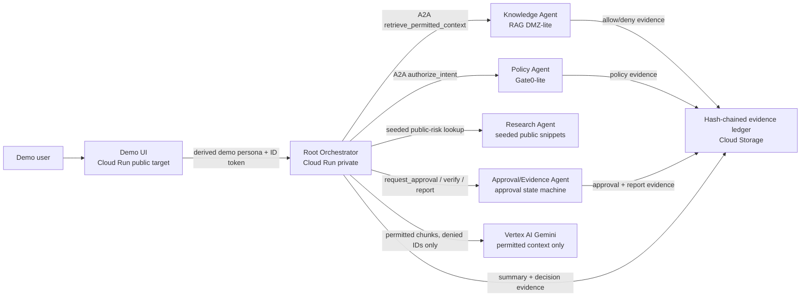

# Architecture

Renderable source for generated assets: `docs/architecture.mmd`.
Submission images: `output/architecture/akretic-a2a-architecture.svg` and
`output/architecture/akretic-a2a-architecture.png`.

## Invariant

Identity, retrieval, tool calls, egress, approvals, and evidence are controlled outside the model.

## Data flow

1. UI sends vendor-risk request with demo persona header.
2. Root derives actor identity from adapter/header/session.
3. Root creates `run_id`.
4. Root calls Policy Agent before material actions.
5. Knowledge Agent retrieves only chunks permitted by metadata and policy.
6. Root passes only permitted chunks to Gemini.
7. Sensitive side-effect requests create approval request.
8. Evidence ledger records all material decisions and results.

## Trust boundary

Gemini may summarize permitted context. Gemini does not decide authorization,
approval, identity, source access, or evidence validity.

## P0 implementation note

The current proof path uses Vertex/Gemini summarization and thin A2A Agent Card
skill-call wiring, with ADK alignment documented as part of the Google Cloud
agent architecture path rather than overclaiming full ADK-native orchestration.
Managed Agent Runtime alignment remains stretch work after the Cloud Run proof
path is public and stable.
